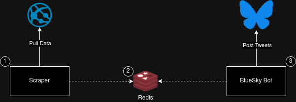

# BlueSky Bot

A simple project that scrapes websites and publishes tweets on [BlueSky](https://bsky.app/).

**⚠️ Work In Progress ⚠️**


## Architecture



The architecture is composed of the following elements:

1. The Scrapper

It scrapes data from one or more websites and publishes a JSON on **Redis Streams**.

It is configured via CLI arguments 

```bash
Usage: scrapper [OPTIONS] --redis-connection-string <REDIS_CONNECTION_STRING> --redis-stream-name <REDIS_STREAM_NAME>

Options:
  -r, --redis-connection-string <REDIS_CONNECTION_STRING>
          Redis host
  -t, --redis-stream-name <REDIS_STREAM_NAME>
          Redis stream name
  -s, --scrape-interval-minutes <SCRAPE_INTERVAL_MINUTES>
          The scraping interval in minutes [default: 60]
  -h, --help
          Print help
  -V, --version
          Print version
```

2. Redis

Redis is a key-value store with lots of features. It has been chosen to keep 
things simple and due to its powerful features and flexibility[1].

3. BlueSky Bot

The BlueSky bot reads data from Redis Streams and publishes it to BlueSky.

[1] - https://redis.io/about/

