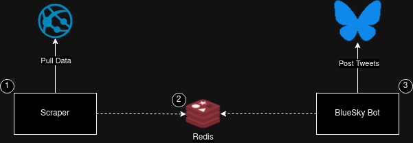

# Social Media News Bot

A simple Bot that scrapes websites and publishes tweets on 
[BlueSky](https://bsky.app/), [Mastodon](https://joinmastodon.org) and [X](https://x.com/).

It's built with [Rust](https://www.rust-lang.org/) and [Redis](https://redis.io/) and can be extended to include 
LLM support for content summarization, suggestions and other features.

Demo:


## Architecture



The architecture is composed of the following elements:

1. The Scrapper

It scrapes data from one or more websites and publishes a JSON on **Redis Streams**.

It is configured via CLI arguments 

```bash
Usage: scraper [OPTIONS] --redis-connection-string <redis_connection_string> --redis-stream-name <REDIS_STREAM_NAME>

Options:
  -r, --redis-connection-string <redis_connection_string>
          Redis host
  -t, --redis-stream-name <REDIS_STREAM_NAME>
          Redis stream name
  -s, --scrape-interval-minutes <SCRAPE_INTERVAL_MINUTES>
          The scraping interval in minutes [default: 60]
  -h, --help
          Print help
  -V, --version
          Print version
```

2. Redis

Redis is a key-value store with lots of features. It has been chosen to keep 
things simple and due to its powerful features and flexibility[1].

3. BlueSky / Mastodon Bot / X

The bot reads data from Redis Streams and publishes it to the selected platform.

```shell
Social media posting bot.

Usage: bot [OPTIONS] --redis-connection-string <REDIS_CONNECTION_STRING> --redis-stream-name <REDIS_STREAM_NAME> --redis-consumer-group <REDIS_CONSUMER_GROUP> --redis-consumer-name <REDIS_CONSUMER_NAME> <COMMAND>

Commands:
  bluesky   Command to start bot for the Bluesky platform
  mastodon  Command to start bot for the Mastodon platform, also called the Fediverse
  x         Command to start the bot for the X platform
  help      Print this message or the help of the given subcommand(s)

Options:
  -r, --redis-connection-string <REDIS_CONNECTION_STRING>
          Redis host
  -t, --redis-stream-name <REDIS_STREAM_NAME>
          Redis stream name
  -c, --redis-consumer-group <REDIS_CONSUMER_GROUP>
          Redis consumer group name
  -n, --redis-consumer-name <REDIS_CONSUMER_NAME>
          The current consumer name
  -s, --post-pause-time <POST_PAUSE_TIME>
          Represents the time in seconds to pause between posts [default: 120]
  -h, --help
          Print help
  -V, --version
          Print version
```

If you need help with a particular platform's requirements you can execute `bot x --help`.

```text
➜  social-media-news-bot git:(master) ✗ cargo run --bin bot x --help
   Compiling bot v0.1.0 (/home/dnutiu/RustroverProjects/social-media-news-bot/bot)
    Finished `dev` profile [unoptimized + debuginfo] target(s) in 0.63s
     Running `target/debug/bot x --help`
Command to start the bot for the X platform

Usage: bot --redis-connection-string <REDIS_CONNECTION_STRING> --redis-stream-name <REDIS_STREAM_NAME> --redis-consumer-group <REDIS_CONSUMER_GROUP> --redis-consumer-name <REDIS_CONSUMER_NAME> x --consumer-key <CONSUMER_KEY> --consumer-secret <CONSUMER_SECRET> --access-token <ACCESS_TOKEN> --access-token-secret <ACCESS_TOKEN_SECRET>

Options:
  -c, --consumer-key <CONSUMER_KEY>                The consumer key for Oauth1 flow
  -s, --consumer-secret <CONSUMER_SECRET>          The consumer secret for Oauth1 flow
  -a, --access-token <ACCESS_TOKEN>                The access token
  -t, --access-token-secret <ACCESS_TOKEN_SECRET>  The access token secret
  -h, --help   
```

### X Platform

For the X platform you will need to create an Application and use the old Oauth1.0 flow in order to authenticate the bot.
You will also need to change the permissions of your app for the access token to be Read & Write (by default it's read).

[1] - https://redis.io/about/

## Development

The rust version used for development is `rustc 1.92.0 (ded5c06cf 2025-12-08)`.

### Running the tests

The tests can be run with `cargo test`.

Tests use testcontainers by default to spin the necessary dependencies, currently only Redis is required.
Alternatively you can use `REDIS_TESTS_URL` in order to make the tests run agains an existing Redis service.

**Note**: For Podman users you will need to enable the podman socket. Otherwise, testcontainers won't be able to 
create new containers[1].

```shell
systemctl enable podman.socket
podman system service --time=0 &
```

## Running locally

You can build the project and run each binary separately. A `docker-compose.yml` file is provided in order to start
necessary dependencies.

[1] - https://podman-desktop.io/tutorial/testcontainers-with-podman

--- 


